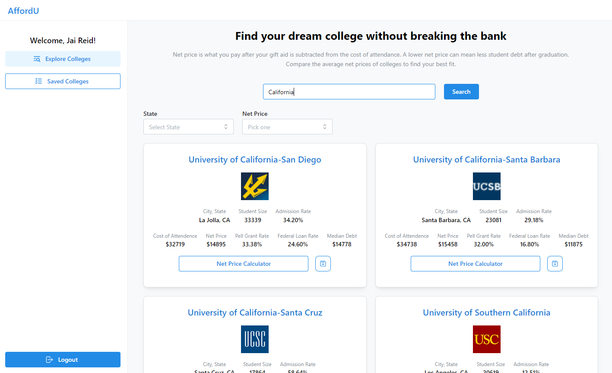

# AffordU

A responsive application enabling users to search, filter, compare, and save colleges based on average net price.

### Screenshot

### Built with

- TypeScript
- React using Vite
- Backend-as-a-Service (BaaS) Firebase
- Mantine
- Axios

### It includes the following

- College Scorecard API integration with Axios
- Authentication with Firebase's GoogleAuthProvider
- Firestore database where users and saved colleges are stored

### Install Dependencies

npm install

### Run

npm run dev
